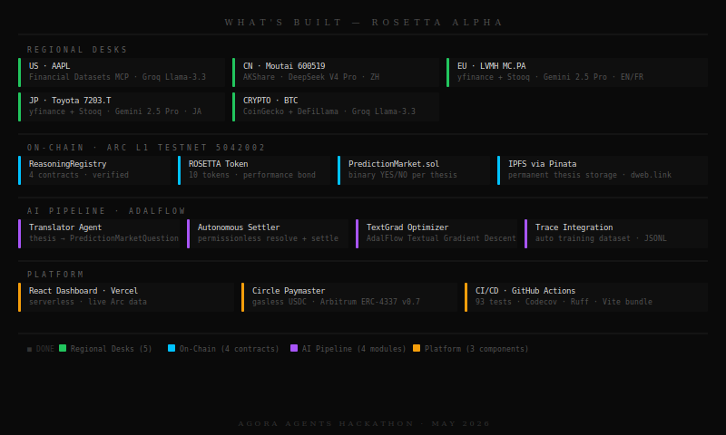
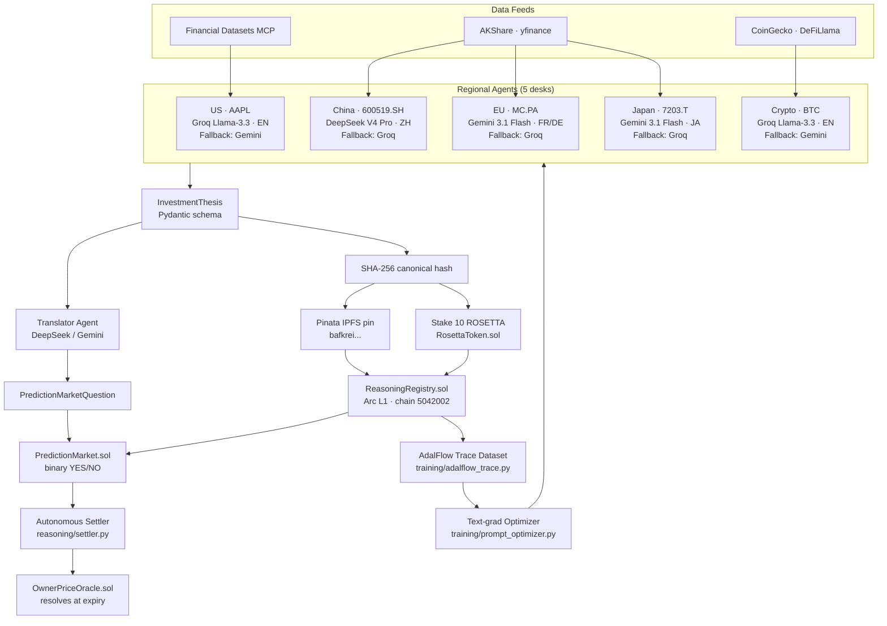
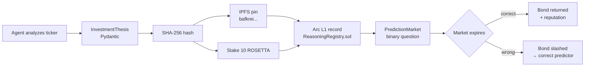

<p align="center">
  
</p>

# Rosetta Alpha

[](https://github.com/Mihai-Codes/rosetta-alpha/actions/workflows/ci.yml)
[](https://codecov.io/gh/Mihai-Codes/rosetta-alpha)
[](https://www.python.org/)
[](https://github.com/SylphAI-Inc/AdalFlow)
[](https://testnet.arcscan.app)
[](https://app.pinata.cloud)
[](LICENSE)
[](https://agora.thecanteenapp.com/)

> *"Dalio's All Weather — diversified across languages and regions, not just asset classes."*

Multi-language AI financial research platform. Five regional agents each reason in their native language, then every thesis is hashed, pinned to IPFS, staked with a ROSETTA performance bond, and recorded immutably on **Arc L1** — closing the full accountability loop automatically.

**Live dashboard:** [rosetta-alpha.vercel.app](https://rosetta-alpha.vercel.app)  
**Hackathon:** Canteen × Arc — Agora Agents · May 11–25, 2026  
**Builder:** Mihai Chindris

---

## What's Built

<p align="center">
  
</p>

---

## Architecture



---

## Agent Design

### Multi-Language, Multi-Model Routing

| Desk | Ticker | Language | Primary | Fallback |
|------|--------|----------|---------|---------|
| US | AAPL | English | Groq Llama-3.3-70B | Gemini 3.1 Flash |
| China | 600519.SH | Simplified Chinese | DeepSeek V4 Pro | Groq Llama-3.3 |
| EU | MC.PA | English/French | Gemini 3.1 Flash | Groq |
| Japan | 7203.T | Japanese | Gemini 3.1 Flash | Groq |
| Crypto | BTC | English | Groq Llama-3.3-70B | Gemini 3.1 Flash |

**Why native languages?** DeepSeek V4 Pro reasons about Kweichow Moutai in Mandarin with context that English models lack — PBOC policy nuance, Moutai's cultural premium, A-share retail dynamics. `thesis_summary_en` is always English for cross-desk aggregation.

Each desk runs 2–3 specialist sub-agents (Fundamental, Technical, Sentiment, Macro) whose outputs are reconciled by a Portfolio Manager into a single `InvestmentThesis`. All prompts are AdalFlow `Parameter` objects — optimizable via Textual Gradient Descent; baked improvements are stored in `training/learned_guidelines.json` and injected into every future synthesis prompt.

### Data Sources

| Desk | Primary | Fallback |
|------|---------|---------|
| US | Financial Datasets API (SEC filings, fundamentals, news) | yfinance |
| China | AKShare (Eastmoney, free) | yfinance `600519.SS` |
| EU | yfinance | Stooq (pandas-datareader) |
| Japan | yfinance | Stooq (pandas-datareader) |
| Crypto | CoinGecko + DeFiLlama | Binance public API |

---

## Smart Contracts (Arc Testnet — Chain ID 5042002)

All 4 contracts verified on [arcscan.app](https://testnet.arcscan.app):

| Contract | Address | Purpose |
|----------|---------|---------|
| `ReasoningRegistry` | [`0x0677...`](https://testnet.arcscan.app/address/0x06775Be99CfBC9A6D0819ff87A67954a2E976A16) | Immutable log of trace hashes + IPFS CIDs |
| `RosettaToken` | [`0x8ec6...`](https://testnet.arcscan.app/address/0x8ec6FDd0fc9ca15eFEE86E31eC50B65F80f1f14d) | ERC-20 performance bond (10 ROSETTA/trace) |
| `PredictionMarket` | [`0x5700...`](https://testnet.arcscan.app/address/0x570034f17e8aFc22aF885607fF26Fe90Beb97596) | Binary YES/NO markets per thesis |
| `OwnerPriceOracle` | [`0x387C...`](https://testnet.arcscan.app/address/0x387C8cbCC2711A5d2388000D1DAE728542284824) | Price feed for market resolution |

### Live TX Evidence (May 15, 2026)

| Desk | Arc Registry TX | IPFS Thesis CID |
|------|----------------|-----------------|
| US · AAPL | [`6141a016...`](https://testnet.arcscan.app/tx/6141a0161a64b84093c2655774cb73842a593bdbd5b8fe2e8272ae091052bab4) | `bafkreiaei...` |
| Crypto · BTC | [`37dd5f73...`](https://testnet.arcscan.app/tx/37dd5f73e82f7855addc9a5cd74d7a2e3aa190d6407fb8e23788ed1c81ab470e) | `bafkreieng...` |
| China · Moutai | [`9e706957...`](https://testnet.arcscan.app/tx/9e70695759ca4293c2602c9680d4b9135c3f587a09ba82b59aefd6d3bbd96f32) | `bafkreifdai...` |
| EU · LVMH | [`2e27a822...`](https://testnet.arcscan.app/tx/2e27a822c1e67c9bb48def0805e0586ca113e7dd2907b02a0441dd2f91995d4f) | `bafkreidio...` |
| Japan · Toyota | [`3919bedc...`](https://testnet.arcscan.app/tx/3919bedc121c39542bdaa9b2196e0152cc9771c6ddd0a5f4be70f9d5d083ed7d) | `bafkreihxx...` |

---

## AdalFlow Integration

Built on [SylphAI's AdalFlow](https://github.com/SylphAI-Inc/AdalFlow). After text-grad optimization, composite judge score improved to **~9.0 / 10**.

| Component | Role |
|-----------|------|
| `adal.Generator` | Provider-agnostic LLM calls (Groq / Gemini / DeepSeek) |
| `adal.Parameter` | Every prompt is a trainable parameter |
| `PydanticJsonParser` | Bridges AdalFlow string output → Pydantic domain models |
| `prompt_optimizer.py` | Text-grad sweep — multi-round judge/critique loop |
| `bake_feedback.py` | Distils ephemeral feedback → permanent `learned_guidelines.json` |
| `adalflow_trace.py` | Every run logged to `rosetta_dataset.jsonl` for future fine-tuning |

```bash
# Run a single optimization sweep
uv run python -m training.prompt_optimizer

# Bake ephemeral feedback into permanent guidelines
uv run python -m training.bake_feedback
```

---

## The Accountability Loop



Every AI claim is financially accountable. Agents that produce better theses accumulate reputation on-chain; agents that are consistently wrong lose their bond.

---

## Quick Start

```bash
# 1. Install uv (https://docs.astral.sh/uv/) then:
uv sync --all-extras

# 2. Add your free Groq key — that's all you need to run a desk
echo "GROQ_API_KEY=your_key_here" > .env

# 3. Run a single desk
uv run python -m agents.us_agent --ticker AAPL
uv run python -m agents.china_agent --ticker 600519.SH

# 4. Run full E2E pipeline (all 5 desks — analyze → pin → stake → record → market)
uv run python -m demo.e2e_run

# 5. Run tests
uv run pytest tests/ -q
```

### Minimum Viable Setup (one free key)

| Variable | Source | Gets you |
|----------|--------|----------|
| `GROQ_API_KEY` | [console.groq.com](https://console.groq.com) (free) | US + Crypto desks |
| `GEMINI_API_KEY` | [aistudio.google.com](https://aistudio.google.com) (free) | EU + Japan desks + fallbacks |

### Full Pipeline (all 5 desks + on-chain)

| Variable | Source | Required for |
|----------|--------|-------------|
| `FINANCIAL_DATASETS_API_KEY` | [financialdatasets.ai](https://financialdatasets.ai) | US desk high-fidelity SEC data |
| `DEEPSEEK_API_KEY` | [platform.deepseek.com](https://platform.deepseek.com) | China desk native ZH reasoning |
| `PINATA_JWT` | [app.pinata.cloud](https://app.pinata.cloud) | IPFS pinning |
| `ARC_RPC_URL` | [arc.network](https://www.arc.network) → Community → Discord | On-chain recording |
| `ARC_DEPLOYER_PRIVATE_KEY` | Your Arc wallet (`Settings → Export Key`) | On-chain recording |
| `TUSHARE_TOKEN` | [tushare.pro](https://tushare.pro) | China desk alt data (optional) |

---

## Repo Layout

```
rosetta-alpha/
├── agents/          # Regional + translator LLM agents
│   ├── base_agent.py        # Abstract base (TradingAgents pattern)
│   ├── us_agent.py          # US equities (Financial Datasets MCP)
│   ├── china_agent.py       # A-shares (AKShare + DeepSeek)
│   ├── crypto_agent.py      # Crypto (CoinGecko + DeFiLlama)
│   ├── eu_agent.py          # EU equities (yfinance + Gemini)
│   ├── japan_agent.py       # JP equities (yfinance + Gemini)
│   └── translator_agent.py  # Thesis → PredictionMarketQuestion
├── reasoning/
│   ├── trace_schema.py      # Pydantic domain models
│   ├── hasher.py            # SHA-256 canonical hash
│   ├── ipfs_pinner.py       # Pinata IPFS pinning
│   ├── arc_recorder.py      # Arc on-chain recording + market creation
│   └── settler.py           # Autonomous settler: poll → resolve → settle
├── training/
│   ├── adalflow_trace.py    # Training dataset generator (JSONL)
│   ├── prompt_optimizer.py  # Text-grad sweep runner
│   └── bake_feedback.py     # Distill feedback → permanent guidelines
├── contracts/src/           # Solidity contracts (verified on Arc testnet)
├── frontend/                # React + Tailwind dashboard (Vercel)
│   └── api/results.js       # Serverless function — live Arc data
├── demo/
│   └── e2e_run.py           # Full pipeline orchestrator
├── scripts/
│   └── circle_paymaster_demo.js  # Circle Paymaster (ERC-4337 v0.7) gasless USDC
└── tests/                   # pytest suite
```

---

## Acknowledgements

- **Ray Dalio / Bridgewater** — All Weather risk-parity framework (publicly documented; not affiliated)
- **SylphAI** — AdalFlow multi-agent framework
- **Arc / Circle** — L1 blockchain and stablecoin infrastructure
- **TradingAgents** (arXiv 2504.13077) — multi-analyst sub-agent architecture pattern
