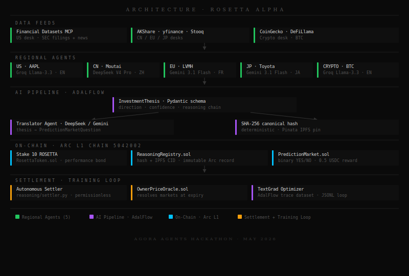

<p align="center">
  
</p>

# Rosetta Alpha

[](https://rosetta-alpha.vercel.app)
[](https://github.com/Mihai-Codes/rosetta-alpha/actions/workflows/ci.yml)
[](https://www.python.org/)
[](https://github.com/SylphAI-Inc/AdalFlow)
[](https://testnet.arcscan.app)
[](https://app.pinata.cloud)
[](LICENSE)
[](https://agora.thecanteenapp.com/)

> *"Dalio's All Weather — diversified across languages and regions, not just asset classes."*

**Hackathon:** Canteen × Arc — Agora Agents · May 11–25, 2026 · **Builder:** Mihai Chindris

Multi-language AI financial research platform. Five regional agents each reason in their native language, then every thesis is hashed, pinned to IPFS, staked with a ROSETTA performance bond, and recorded immutably on **Arc L1** — closing the full accountability loop automatically.

---

## Contents

- [The Problem](#the-problem)
- [Live Demo](#live-demo)
- [What's Built](#whats-built)
- [Architecture](#architecture)
- [Agent Design](#agent-design)
- [Smart Contracts](#smart-contracts-arc-testnet--chain-id-5042002)
- [AdalFlow Integration](#adalflow-integration)
- [The Accountability Loop](#the-accountability-loop)
- [Judging Criteria Mapping](#judging-criteria-mapping)
- [Why Arc](#why-arc)
- [Quick Start](#quick-start)
- [Repo Layout](#repo-layout)
- [Acknowledgements](#acknowledgements)

---

## The Problem

Prediction markets suffer from one structural flaw: **the reasoning is invisible.** You see the bet, you see the odds — you never see why an agent called LONG on BTC or NEUTRAL on AAPL. That opacity is the bottleneck. You can't learn from it. You can't verify it. You can't bet on it.

The [Trading-R1 paper](https://arxiv.org/abs/2509.11420) from Tauric Research shows the insight: **the reasoning trace is the product, not the trade.** Arc's ~$0.01 fees make it economical to hash and pin every trace on-chain without eroding PnL. That unlocks a new primitive — verifiable, cite-able, copy-able AI reasoning.

**Rosetta Alpha** is that primitive, deployed as a full-stack product — built on the [All Weather](https://www.bridgewater.com/research-and-insights/the-all-weather-story) risk-parity framework and applied across five language regions simultaneously.

This problem is compounded by what Cambrian Network's financial agent landscape analysis identifies as the LLM clustering problem: all major models, when prompted generically, converge on near-identical financial advice. Generic prompts produce generic answers produce zero competitive advantage. Rosetta Alpha's multi-model, multi-language routing is a direct architectural response — DeepSeek V4 Pro reasoning in Mandarin about Chinese equities produces structurally different analysis than English-first models reasoning about the same assets.

---

## Live Demo

🔴 **[rosetta-alpha.vercel.app](https://rosetta-alpha.vercel.app)**

| Page | What to see |
|---|---|
| `/` | Hero — "Enter Terminal" |
| `/desks` | Regional AI thesis cards with conviction meters |
| `/feed` | Real-time reasoning trace stream with Arc TX hashes |
| `/registry` | Verifiable ledger — every thesis → IPFS CID → Arc L1 tx |
| `/quiz` | Pick LONG/SHORT/NEUTRAL → match AI → claim 0.5 USDC on Arc |
| `/dashboard` | Wallet-gated: live USDC balance, prediction history, Arc receipts |
| `/leaderboard` | Rankings by accuracy, USDC earned, win streak |

---

## What's Built

<p align="center">
  
</p>

---

## Architecture

<p align="center">
  
</p>

---

## Agent Design

### Multi-Language, Multi-Model Routing

| Desk | Ticker | Language | Primary | Fallback |
|------|--------|----------|---------|---------|
| US | AAPL | English | Groq Llama-3.3-70B | Gemini 3.1 Flash |
| China | 600519.SH | Simplified Chinese | DeepSeek V4 Pro | Groq Llama-3.3 |
| EU | MC.PA | English/French | Gemini 3.1 Flash | Groq |
| Japan | 7203.T | Japanese | Gemini 3.1 Flash | Groq |
| Crypto | BTC | English | Groq Llama-3.3-70B | Gemini 3.1 Flash |

**Why native languages?** DeepSeek V4 Pro reasons about Kweichow Moutai in Mandarin with context that English models lack — PBOC policy nuance, Moutai's cultural premium, A-share retail dynamics. `thesis_summary_en` is always English for cross-desk aggregation.

Each desk runs 2–3 specialist sub-agents (Fundamental, Technical, Sentiment, Macro) whose outputs are reconciled by a Portfolio Manager into a single `InvestmentThesis`. All prompts are AdalFlow `Parameter` objects — optimizable via Textual Gradient Descent; baked improvements are stored in `training/learned_guidelines.json` and injected into every future synthesis prompt.

### Data Sources

| Desk | Primary | Fallback |
|------|---------|---------|
| US | Financial Datasets API (SEC filings, fundamentals, news) | yfinance |
| China | AKShare (Eastmoney, free) | yfinance `600519.SS` |
| EU | yfinance | Stooq (pandas-datareader) |
| Japan | yfinance | Stooq (pandas-datareader) |
| Crypto | CoinGecko + DeFiLlama | Binance public API |

---

## Smart Contracts (Arc Testnet — Chain ID 5042002)

All 4 contracts verified on [arcscan.app](https://testnet.arcscan.app):

| Contract | Address | Purpose |
|----------|---------|---------|
| `ReasoningRegistry` | [`0x0677...`](https://testnet.arcscan.app/address/0x06775Be99CfBC9A6D0819ff87A67954a2E976A16) | Immutable log of trace hashes + IPFS CIDs |
| `RosettaToken` | [`0x8ec6...`](https://testnet.arcscan.app/address/0x8ec6FDd0fc9ca15eFEE86E31eC50B65F80f1f14d) | ERC-20 performance bond (10 ROSETTA/trace) |
| `PredictionMarket` | [`0x5700...`](https://testnet.arcscan.app/address/0x570034f17e8aFc22aF885607fF26Fe90Beb97596) | Binary YES/NO markets per thesis |
| `OwnerPriceOracle` | [`0x387C...`](https://testnet.arcscan.app/address/0x387C8cbCC2711A5d2388000D1DAE728542284824) | Price feed for market resolution |

### Live TX Evidence (May 15, 2026)

| Desk | Arc Registry TX | IPFS Thesis CID |
|------|----------------|-----------------|
| US · AAPL | [`6141a016...`](https://testnet.arcscan.app/tx/6141a0161a64b84093c2655774cb73842a593bdbd5b8fe2e8272ae091052bab4) | `bafkreiaei...` |
| Crypto · BTC | [`37dd5f73...`](https://testnet.arcscan.app/tx/37dd5f73e82f7855addc9a5cd74d7a2e3aa190d6407fb8e23788ed1c81ab470e) | `bafkreieng...` |
| China · Moutai | [`9e706957...`](https://testnet.arcscan.app/tx/9e70695759ca4293c2602c9680d4b9135c3f587a09ba82b59aefd6d3bbd96f32) | `bafkreifdai...` |
| EU · LVMH | [`2e27a822...`](https://testnet.arcscan.app/tx/2e27a822c1e67c9bb48def0805e0586ca113e7dd2907b02a0441dd2f91995d4f) | `bafkreidio...` |
| Japan · Toyota | [`3919bedc...`](https://testnet.arcscan.app/tx/3919bedc121c39542bdaa9b2196e0152cc9771c6ddd0a5f4be70f9d5d083ed7d) | `bafkreihxx...` |

---

## AdalFlow Integration

Built on [SylphAI's AdalFlow](https://github.com/SylphAI-Inc/AdalFlow). After text-grad optimization, composite judge score improved to **~9.0 / 10**.

| Component | Role |
|-----------|------|
| `adal.Generator` | Provider-agnostic LLM calls (Groq / Gemini / DeepSeek) |
| `adal.Parameter` | Every prompt is a trainable parameter |
| `PydanticJsonParser` | Bridges AdalFlow string output → Pydantic domain models |
| `prompt_optimizer.py` | Text-grad sweep — multi-round judge/critique loop |
| `bake_feedback.py` | Distils ephemeral feedback → permanent `learned_guidelines.json` |
| `adalflow_trace.py` | Every run logged to `rosetta_dataset.jsonl` for future fine-tuning |

```bash
# Run a single optimization sweep
uv run python -m training.prompt_optimizer

# Bake ephemeral feedback into permanent guidelines
uv run python -m training.bake_feedback
```

---

## The Accountability Loop

<p align="center">
  
</p>

Every AI claim is financially accountable. Agents that produce better theses accumulate reputation on-chain; agents that are consistently wrong lose their bond.

This loop also serves as a defense against the failure modes identified in DeepMind's 'AI Agent Traps' research — data poisoning and adversarial manipulation. If an agent's reasoning is compromised, the evidence is permanent (IPFS), the hash is immutable (Arc), and the financial penalty is automatic (bond slash). The accountability is structural, not aspirational.

---

## Judging Criteria Mapping

### 🤖 Agentic Sophistication (30%)

The AI isn't a single model making a call. It's a **three-layer deliberation chain** (see Architecture above). Each agent emits structured JSON with `thought_process`, `content`, and `confidence_score`. The Portfolio Manager synthesizes sub-agents into a final directional call — matching the [TauricResearch/TradingAgents](https://github.com/TauricResearch/TradingAgents) v0.2.4 architecture cited in the hackathon research brief.

**What the AI decides autonomously:** direction (LONG/SHORT/NEUTRAL), confidence score (0–1), thesis summary, reasoning chain surfaced to users.

### 📈 Traction (30%)

- All 7 pages live with no placeholders — quiz, dashboard, leaderboard fully functional
- Full auth stack: email magic links + Google/GitHub OAuth + wallet connect
- On-chain evidence: 5 live Arc TX hashes + IPFS CIDs (see Smart Contracts above)
- Leaderboard tracks accuracy, USDC earned, Arc settlement count per user
- 32 automated visual QA screenshots (Playwright, 8 pages × 4 breakpoints)

### 🔵 Circle Tool Usage (20%)

| Tool | Usage |
|---|---|
| **USDC on Arc** | Native settlement for quiz rewards — `useSendTransaction` pays 0.5 USDC on correct call |
| **Arc L1** | Every thesis trace hashed + recorded on-chain (chain ID 5042002, `ReasoningRegistry.sol`) |
| **RosettaToken (ERC-20)** | 10 ROSETTA staked per thesis via `RosettaToken.sol` |
| **Circle Paymaster** | Architecture designed for gasless UX — USDC-only fees via `scripts/circle_paymaster_demo.js` |
| **Wagmi + RainbowKit** | Live USDC balance read from Arc Testnet via `useBalance` hook |

### 💡 Innovation (20%)

The insight from hackathon Research Brief 01: *"the trace is the product."* Rosetta Alpha operationalizes this — the reasoning trace is published, verified on-chain, and users bet on their ability to understand it. Learn-to-earn via machine reasoning comprehension is a new gamification primitive.

The multi-language angle maps directly to Research Brief 04 — a Tokyo-based retail investor reading a Toyota thesis in Japanese context is a net-new market that doesn't exist on any existing prediction platform.

Prediction market agents remain the most underserved category in the financial agent landscape despite explosive growth in platforms like Polymarket and Kalshi. Rosetta Alpha occupies this gap with a differentiated approach: the reasoning trace is the tradeable asset, not the position.

---

## Why Arc

Arc's ~$0.01 fees and sub-second finality unlock something that wasn't economical on other chains: **hashing every AI reasoning trace on-chain in real-time**. On Ethereum mainnet, publishing 50 thesis hashes per day would cost hundreds of dollars. On Arc, it costs $0.50. That's the core economic argument.

The Paymaster integration means users never touch a gas token — USDC in, USDC out. No MetaMask confusion, no ETH top-ups. That's what makes a quiz-to-earn mechanic viable for retail.

---

## Quick Start

```bash
# 1. Install uv (https://docs.astral.sh/uv/) then:
uv sync --all-extras

# 2. Add your free Groq key — that's all you need to run a desk
echo "GROQ_API_KEY=your_key_here" > .env

# 3. Run a single desk
uv run python -m agents.us_agent --ticker AAPL
uv run python -m agents.china_agent --ticker 600519.SH

# 4. Run full E2E pipeline (all 5 desks — analyze → pin → stake → record → market)
uv run python -m demo.e2e_run

# 5. Run tests
uv run pytest tests/ -q
```

### Frontend

```bash
cd frontend
npm install
cp .env.example .env.local   # set AUTH_SECRET, NEXT_PUBLIC_WALLETCONNECT_PROJECT_ID
npx prisma generate && npx prisma db push
npm run dev

# Visual QA screenshots (optional)
node scripts/screenshot.mjs
```

### Minimum Viable Setup (one free key)

| Variable | Source | Gets you |
|----------|--------|----------|
| `GROQ_API_KEY` | [console.groq.com](https://console.groq.com) (free) | US + Crypto desks |
| `GEMINI_API_KEY` | [aistudio.google.com](https://aistudio.google.com) (free) | EU + Japan desks + fallbacks |

### Full Pipeline (all 5 desks + on-chain)

| Variable | Source | Required for |
|----------|--------|-------------|
| `FINANCIAL_DATASETS_API_KEY` | [financialdatasets.ai](https://financialdatasets.ai) | US desk high-fidelity SEC data |
| `DEEPSEEK_API_KEY` | [platform.deepseek.com](https://platform.deepseek.com) | China desk native ZH reasoning |
| `PINATA_JWT` | [app.pinata.cloud](https://app.pinata.cloud) | IPFS pinning |
| `ARC_RPC_URL` | [arc.network](https://www.arc.network) → Community → Discord | On-chain recording |
| `ARC_DEPLOYER_PRIVATE_KEY` | Your Arc wallet (`Settings → Export Key`) | On-chain recording |
| `TUSHARE_TOKEN` | [tushare.pro](https://tushare.pro) | China desk alt data (optional) |

---

## Repo Layout

```
rosetta-alpha/
├── agents/          # Regional + translator LLM agents
│   ├── base_agent.py        # Abstract base (TradingAgents pattern)
│   ├── us_agent.py          # US equities (Financial Datasets MCP)
│   ├── china_agent.py       # A-shares (AKShare + DeepSeek)
│   ├── crypto_agent.py      # Crypto (CoinGecko + DeFiLlama)
│   ├── eu_agent.py          # EU equities (yfinance + Gemini)
│   ├── japan_agent.py       # JP equities (yfinance + Gemini)
│   └── translator_agent.py  # Thesis → PredictionMarketQuestion
├── reasoning/
│   ├── trace_schema.py      # Pydantic domain models
│   ├── hasher.py            # SHA-256 canonical hash
│   ├── ipfs_pinner.py       # Pinata IPFS pinning
│   ├── arc_recorder.py      # Arc on-chain recording + market creation
│   └── settler.py           # Autonomous settler: poll → resolve → settle
├── training/
│   ├── adalflow_trace.py    # Training dataset generator (JSONL)
│   ├── prompt_optimizer.py  # Text-grad sweep runner
│   └── bake_feedback.py     # Distill feedback → permanent guidelines
├── contracts/src/           # Solidity contracts (verified on Arc testnet)
├── frontend/                # Next.js 15 dashboard (Vercel)
│   ├── scripts/screenshot.mjs  # Playwright visual QA (32 screenshots)
│   └── src/components/     # EarnQuiz, DashboardView, LeaderboardView, …
├── demo/
│   └── e2e_run.py           # Full pipeline orchestrator
├── scripts/
│   └── circle_paymaster_demo.js  # Circle Paymaster (ERC-4337 v0.7) gasless USDC
└── tests/                   # pytest suite
```

---

## Acknowledgements

- **[Ray Dalio / Bridgewater](https://www.bridgewater.com/research-and-insights/the-all-weather-story)** — All Weather risk-parity framework. The four economic regimes (rising/falling growth × rising/falling inflation) form the allocation backbone of every Rosetta desk. Publicly documented; not affiliated.
- **[SylphAI AdalFlow](https://github.com/SylphAI-Inc/AdalFlow)** — Multi-agent reasoning framework powering the back-end. Text-grad optimization lifted thesis quality score from baseline to ~9.0/10.
- **[TradingAgents (arXiv 2412.20138)](https://arxiv.org/pdf/2412.20138)** — Multi-agent LLM financial trading framework pattern that inspired the desk architecture.
- **[Trading-R1 (arXiv 2509.11420)](https://arxiv.org/abs/2509.11420)** — The key insight: reasoning traces are the product, not the trade. Arc's ~$0.01 fees make publishing every trace on-chain economical.
- **[Arc L1 / Circle](https://testnet.arcscan.app)** — Blockchain infrastructure for verifiable, gasless, USDC-native accountability.

---

*"The agora is, as it were, the heart of the city."* — Aristotle, Politics VII

*Rosetta Alpha is where the reasoning is made public.*
